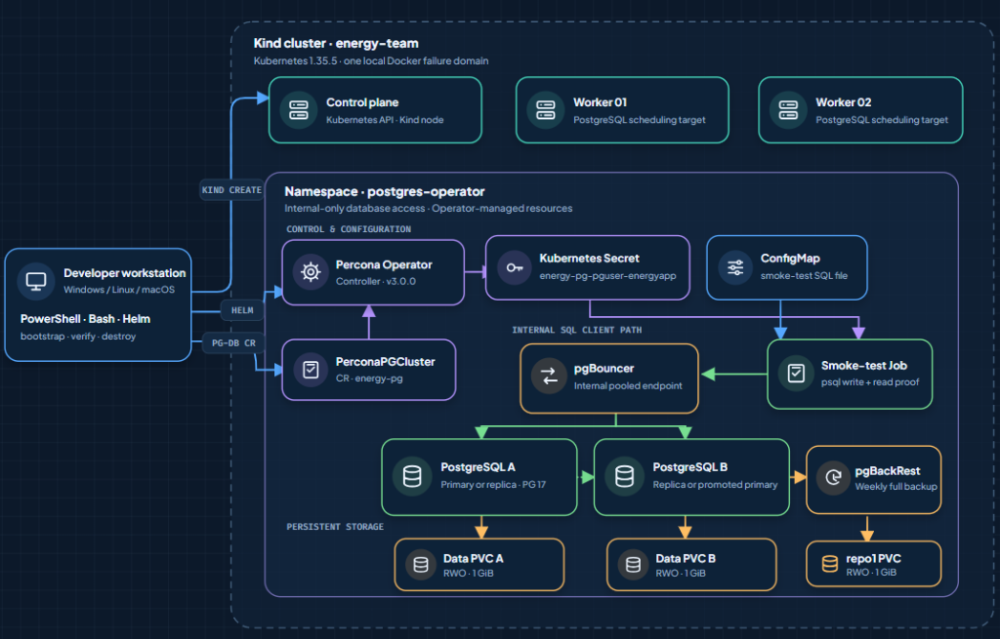
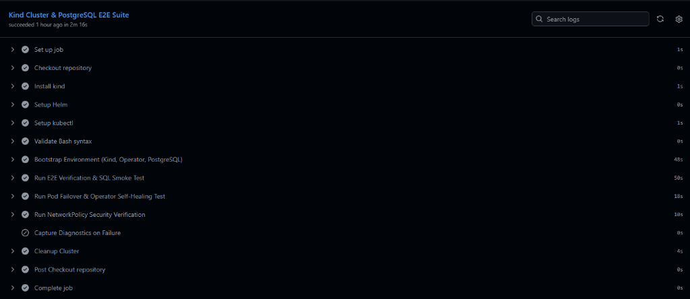

# PostgreSQL on Kubernetes with Percona Operator

[](https://github.com/LiorTal26/energy-k8s-postgres/actions/workflows/e2e-ci.yml)

This repository creates a repeatable local Kubernetes environment, installs Percona Operator for PostgreSQL, deploys a replicated PostgreSQL cluster, and proves database connectivity with an automated SQL write/read test.

The result is a local engineering demonstration on one workstation. It shows reconciliation, replication, connection pooling, persistent volumes, backup configuration, and network-policy enforcement, and includes an optional Pod-level failover check. It is not a production high-availability design.

## Contents

- [Architecture](#architecture)
- [What is deployed](#what-is-deployed)
- [Prerequisites](#prerequisites)
- [Quick start](#quick-start)
- [Expected result](#expected-result)
- [Validation record](#validation-record)
- [Optional validation](#optional-validation)
- [Manual deployment](#manual-deployment)
- [Interactive SQL and GUI access](#interactive-sql-and-gui-access)
- [Design decisions](#design-decisions)
- [Limitations and production evolution](#limitations-and-production-evolution)
- [Troubleshooting](#troubleshooting)
- [Cleanup](#cleanup)
- [Repository layout](#repository-layout)

## Architecture



The Kind topology contains one control-plane and two worker nodes. Required Pod anti-affinity places the two PostgreSQL instances on different Kind workers, while pgBouncer, pgBackRest, and the Percona Operator run in dedicated pods.

> [!TIP]
> ### 🌐 Interactive Blueprint & Live HA Simulator
> For interactive layer filtering (`Automation`, `Kubernetes`, `Database`, `Storage`, `Validation`), 6 directional traffic flow tracks, and live failover crash simulation, open the interactive portal:
>
> **👉 [Open Interactive Architecture & System-Flow Portal (ARCHITECTURE.html)](ARCHITECTURE.html)**
>
> *To view locally: double-click `ARCHITECTURE.html` in your file explorer or run `Start-Process ./ARCHITECTURE.html` in PowerShell (`open ./ARCHITECTURE.html` on macOS / `xdg-open` on Linux).*

## What is deployed

| Component | Configuration |
| --- | --- |
| Kind | `energy-team`, one control-plane and two workers |
| Kubernetes | Node image `v1.35.5` pinned by digest |
| Percona Operator | Official `percona/pg-operator` chart, version `3.0.0` |
| PostgreSQL cluster | Official `percona/pg-db` chart, version `3.0.0` |
| PostgreSQL | Two PostgreSQL 17.10-1 instances |
| Connection endpoint | One internal pgBouncer 1.25.2-1 instance |
| Storage | Two 1 GiB data PVCs and one 1 GiB pgBackRest PVC |
| Backup | pgBackRest 2.58.0-2, weekly full schedule, retention of one full backup |
| Application identity | Non-superuser `energyapp` with database `energydb` |
| Verification | Secret-backed in-cluster `psql` Job with idempotent write/read SQL |

The selected component versions are within the [Percona Operator 3.0.0 compatibility matrix](https://docs.percona.com/percona-operator-for-postgresql/3.0.0/versions.html).

## Prerequisites

- Docker Desktop using Linux containers, or Docker Engine on Linux.
- At least 4 CPU cores, 6 GiB memory, and approximately 20 GiB free disk available to Docker.
- [Kind](https://kind.sigs.k8s.io/docs/user/quick-start/); version `0.33.0` is pinned for CI.
- [kubectl](https://kubernetes.io/docs/tasks/tools/) compatible with Kubernetes 1.35.
- [Helm](https://helm.sh/docs/intro/install/).
- Internet access to the Percona Helm repository and required container registries during the first deployment.

The scripts check their required commands and fail before deployment if Docker or a dependency is unavailable. All tools must be available on `PATH`; no user-specific installation path is assumed.

## Quick start

Run commands from the repository root.

### PowerShell — primary Windows path

```powershell
./scripts/powershell/bootstrap.ps1
./scripts/powershell/verify.ps1
```

### Bash — Linux, macOS, Git Bash, or CI

```bash
bash scripts/bash/bootstrap.sh
bash scripts/bash/verify.sh
```

`bootstrap` reuses the named Kind cluster when it already exists and uses `helm upgrade --install`, so it is safe to run again. `verify` waits for the Operator-managed custom resource to become ready and then runs the SQL smoke test through pgBouncer.

## Expected result

A successful verification proves all of the following:

- Exactly three Kind nodes are `Ready`.
- The `pg-operator-3.0.0` and `pg-db-3.0.0` Helm releases are `deployed`.
- The Operator Deployment and four Percona CRDs are available.
- `energy-pg` reports state `ready`.
- Two PostgreSQL Pods run on distinct Kind workers.
- pgBouncer and the pgBackRest repository host are running.
- All PostgreSQL PVCs are `Bound`.
- The generated `energy-pg-pguser-energyapp` Secret exists.
- The smoke-test Job connects through pgBouncer, creates or updates a row, and reads it back.

Representative SQL output:

```console
 database | database_user |               postgres_version                |               smoke_test_result
----------+---------------+-----------------------------------------------+-----------------------------------------------
 energydb | energyapp     | 17.10 - Percona Server for PostgreSQL 17.10.1 | Percona PostgreSQL on Kubernetes is reachable
```

The SQL is idempotent: rerunning verification updates the same row instead of failing on an existing object.

## Validation record

The environment was validated end-to-end locally and in remote CI:

- **Local Windows & Linux / Git Bash:** PowerShell and Bash bootstrap, verification, Pod failover, and NetworkPolicy enforcement executed with exit code 0.
- **GitHub Actions E2E CI Suite:** Automated multi-node Kind workflow passed all 8 pipeline steps (bootstrap, SQL verification, Patroni failover, NetworkPolicy negative & positive probes, and cluster teardown).
- **Idempotency:** Verification passed multiple consecutive times against the live cluster.

## Optional validation

These tests are useful demonstrations but are not required to satisfy the assignment.

### NetworkPolicy enforcement

```powershell
./scripts/powershell/test-network-policy.ps1
```

```bash
bash scripts/bash/test-network-policy.sh
```

The test applies the policies and creates two temporary Jobs:

- An authorized Job has the expected label and must execute SQL successfully.
- An unauthorized Job has no authorized label and must fail with the exact `psql` connection-timeout signature.

Both Jobs load database fields directly from the Operator-generated Secret through `secretKeyRef`. A generic non-zero exit, image-pull error, DNS error, missing Secret, authentication failure, or scheduling error is treated as a failed test rather than proof of NetworkPolicy enforcement. Probe Jobs are removed at the end.

The pinned Kind environment used for this project enforced these policies in the local probe. A different Kubernetes environment must use a network plugin that implements NetworkPolicy; the negative probe is the acceptance test rather than an assumption about the CNI.

### PostgreSQL Pod failover and Operator self-healing

> [!WARNING]
> This test intentionally deletes the current PostgreSQL primary Pod. Run it only in this disposable demonstration environment.

```powershell
./scripts/powershell/test-failover.ps1
```

```bash
bash scripts/bash/test-failover.sh
```

The test measures two separate events:

1. Patroni promotes the former replica to primary.
2. Kubernetes and the Operator restore two healthy PostgreSQL instances on distinct Kind workers.

It then runs the full verification and SQL write/read test through pgBouncer. This is a Pod-level recovery demonstration on one workstation. It does not prove zero downtime or resilience to physical-host, storage, zone, or site failure.

### GitHub Actions

`.github/workflows/e2e-ci.yml` prepares a fresh Kind environment and runs bootstrap, verification, Pod failover, NetworkPolicy enforcement, diagnostics, and cleanup.



The workflow uses read-only repository permissions, full commit SHAs for reusable Actions, a checksum-verified Kind binary, pinned tool versions, and the repository-local kubeconfig.

## Manual deployment

The scripts are the recommended interface. The commands below show the underlying sequence for review and troubleshooting.

### 1. Create the local Kubernetes environment

```powershell
kind create cluster `
  --name energy-team `
  --config infrastructure/kind/cluster.yaml `
  --kubeconfig .tools/kubeconfig `
  --wait 5m

kubectl --kubeconfig .tools/kubeconfig --context kind-energy-team get nodes
```

### 2. Install Percona Operator

```powershell
helm repo add percona https://percona.github.io/percona-helm-charts/ --force-update
helm repo update percona

helm upgrade --install percona-operator percona/pg-operator `
  --version 3.0.0 `
  --namespace postgres-operator `
  --create-namespace `
  --kube-context kind-energy-team `
  --kubeconfig .tools/kubeconfig `
  --values helm/operator-values.yaml `
  --reset-values `
  --wait `
  --timeout 10m

kubectl --kubeconfig .tools/kubeconfig --context kind-energy-team `
  -n postgres-operator rollout status deployment/percona-operator-pg-operator --timeout=10m
```

At this stage the controller and CRDs exist, but no PostgreSQL cluster has been requested yet.

### 3. Create the PostgreSQL cluster

```powershell
helm upgrade --install energy-pg percona/pg-db `
  --version 3.0.0 `
  --namespace postgres-operator `
  --kube-context kind-energy-team `
  --kubeconfig .tools/kubeconfig `
  --values helm/cluster-values.yaml `
  --reset-values `
  --wait `
  --timeout 15m

kubectl --kubeconfig .tools/kubeconfig --context kind-energy-team `
  -n postgres-operator get pg,pods,pvc
```

The `pg-db` chart creates a `PerconaPGCluster` custom resource. The Operator reconciles that desired state into PostgreSQL Pods, Services, TLS resources, generated credentials, PVCs, pgBouncer, and pgBackRest resources.

### 4. Run the SQL proof

```powershell
kubectl --kubeconfig .tools/kubeconfig --context kind-energy-team `
  -n postgres-operator delete job postgres-smoke-test --ignore-not-found

kubectl --kubeconfig .tools/kubeconfig --context kind-energy-team `
  apply -f tests/smoke-test.yaml

kubectl --kubeconfig .tools/kubeconfig --context kind-energy-team `
  -n postgres-operator wait --for=condition=complete job/postgres-smoke-test --timeout=10m

kubectl --kubeconfig .tools/kubeconfig --context kind-energy-team `
  -n postgres-operator logs job/postgres-smoke-test
```

The Job receives `pgbouncer-host`, `pgbouncer-port`, `user`, `password`, and `dbname` as separate Secret-backed environment variables. It does not place a password-bearing URI in process arguments.

## Interactive SQL and GUI access

The automated Job is the primary connection proof. For optional workstation access, keep the database internal and use a temporary port-forward.

### 1. Start the port-forward

```powershell
kubectl --kubeconfig .tools/kubeconfig --context kind-energy-team `
  -n postgres-operator port-forward service/energy-pg-pgbouncer 15432:5432
```

Keep this terminal open. Port `15432` avoids collisions with a local PostgreSQL service on `5432`.

### 2. Read the generated connection fields

In a second PowerShell terminal:

```powershell
$Secret = kubectl --kubeconfig .tools/kubeconfig --context kind-energy-team `
  -n postgres-operator get secret energy-pg-pguser-energyapp -o json | ConvertFrom-Json

$DbPassword = [Text.Encoding]::UTF8.GetString(
  [Convert]::FromBase64String($Secret.data.password)
)
```

Use these settings in DBeaver, pgAdmin, VS Code SQLTools, or another PostgreSQL client:

| Field | Value |
| --- | --- |
| Host | `127.0.0.1` |
| Port | `15432` |
| Database | `energydb` |
| User | `energyapp` |
| Password | Value held in `$DbPassword` |
| SSL mode | `require` |

If local `psql` is installed:

```powershell
$env:PGPASSWORD = $DbPassword
$env:PGSSLMODE = "require"
psql --host 127.0.0.1 --port 15432 --username energyapp --dbname energydb --file tests/query.sql
Remove-Item Env:PGPASSWORD
```

`sslmode=require` encrypts the connection but does not validate the self-signed server identity. Production clients should trust the intended CA and use strict certificate verification.

## Design decisions

### Kind for the local environment

Kind provides a small declarative multi-node topology that is disposable and CI-friendly. Percona tests Minikube and major managed Kubernetes platforms rather than Kind specifically, so this project treats Kind as a local portability choice, not an officially validated Percona platform.

### Official Helm charts with local values

The project uses the official `percona/pg-operator` and `percona/pg-db` charts, both pinned to `3.0.0`. Local values files contain the assignment-specific configuration. Separate releases preserve the lifecycle boundary between the controller and the database custom resource and make installation order explicit.

An umbrella chart would add dependency and CRD/controller-readiness complexity without providing a useful application release boundary for this exercise.

### Two PostgreSQL instances

Two instances demonstrate streaming replication, role changes, reconciliation, and anti-affinity without the laptop cost of three database instances. This is not quorum-based production HA, and the Kind workers are not independent physical failure domains.

### pgBouncer as the application endpoint

The smoke test and optional clients use the pgBouncer Service instead of connecting directly to a specific PostgreSQL Pod. The Service remains internal; no NodePort or LoadBalancer is created.

### Operator-generated credentials

The application password is not committed. Percona Operator generates the Secret and the test Job consumes only the required keys. In production, Kubernetes Secrets also require encryption at rest, tightly scoped RBAC, rotation, and potentially an external secret manager.

### Local persistence and backup

Each database instance has a 1 GiB data PVC and pgBackRest has a 1 GiB repository PVC. This demonstrates persistent-volume and backup configuration, but the volumes remain inside the same Kind/Docker failure domain. Deleting the Kind cluster deletes all database data.

## Limitations and production evolution

Current limitations:

- One workstation, Docker daemon, disk, network, and power failure domain.
- Kind local-path storage does not provide multi-zone reattachment, snapshots, storage encryption controls, or disaster recovery.
- The pgBackRest repository shares the database failure domain, and no restore drill is automated.
- PMM and a broader metrics/alerting stack are not deployed.
- Kubernetes Secrets are suitable for this local exercise but are not a complete production secret lifecycle.
- Percona component image tags are pinned; a production supply-chain policy should also verify digests, signatures, and SBOMs.
- Bash and PowerShell are maintained as separate interfaces, which requires both paths to remain tested.

Prioritized production improvements:

1. Store pgBackRest backups in S3-compatible object storage outside the database failure domain.
2. Automate restore validation into an isolated cluster and record recovery-point and recovery-time evidence.
3. Use a production CSI StorageClass with independent failure domains; use Trident only when a supported NetApp backend exists.
4. Add PMM or Prometheus/Grafana metrics and alerts for replication lag, backup age, storage, saturation, and connection-pool pressure.
5. Integrate an external secret manager, encryption at rest, and credential-rotation procedures.

Redis, PostgREST, Jenkins, Harbor, Trident, and an umbrella chart are not part of the runtime because the assignment provides no workload or backend that would make those components meaningful.

## Troubleshooting

### Docker is unavailable

```powershell
docker info
```

Start Docker Desktop and confirm it is using Linux containers.

### PostgreSQL does not reach `ready`

```powershell
kubectl --kubeconfig .tools/kubeconfig --context kind-energy-team -n postgres-operator get pg,pods,pvc
kubectl --kubeconfig .tools/kubeconfig --context kind-energy-team -n postgres-operator describe pg energy-pg
kubectl --kubeconfig .tools/kubeconfig --context kind-energy-team -n postgres-operator logs deployment/percona-operator-pg-operator --all-containers
kubectl --kubeconfig .tools/kubeconfig --context kind-energy-team -n postgres-operator get events --sort-by=.lastTimestamp
```

Typical local causes are insufficient Docker memory or disk, restricted image pulls, or an unbound PVC.

### SQL smoke test fails

```powershell
kubectl --kubeconfig .tools/kubeconfig --context kind-energy-team -n postgres-operator describe job postgres-smoke-test
kubectl --kubeconfig .tools/kubeconfig --context kind-energy-team -n postgres-operator logs job/postgres-smoke-test --all-containers
kubectl --kubeconfig .tools/kubeconfig --context kind-energy-team -n postgres-operator get secret energy-pg-pguser-energyapp
```

The final command confirms that the Secret exists without printing its values.

## Cleanup

> [!CAUTION]
> Cleanup permanently deletes the `energy-team` Kind cluster, its PVCs, and all PostgreSQL data. It does not uninstall the Kind executable.

```powershell
./scripts/powershell/destroy.ps1
```

```bash
bash scripts/bash/destroy.sh
```

Both scripts require typing `DELETE`. For a confirmed disposable environment, use `-Force` in PowerShell or `--force` in Bash.

## Repository layout

```text
.
|-- .github/workflows/e2e-ci.yml       # Prepared ephemeral Kind E2E workflow
|-- helm/
|   |-- operator-values.yaml           # Namespace-scoped Operator configuration
|   `-- cluster-values.yaml            # PostgreSQL, pgBouncer, PVC, and backup desired state
|-- infrastructure/
|   |-- kind/cluster.yaml              # Pinned three-node Kind topology
|   `-- k8s/network-policy.yaml        # PostgreSQL and pgBouncer ingress policy
|-- scripts/
|   |-- powershell/                    # Primary Windows automation and validation
|   `-- bash/                          # Linux, macOS, Git Bash, and CI equivalents
|-- tests/
|   |-- smoke-test.yaml                # Secret-backed idempotent SQL Job
|   |-- network-policy-test.yaml       # Authorized and unauthorized policy probes
|   `-- query.sql                      # Optional workstation query
|-- ARCHITECTURE.html                  # Interactive architecture and flow map
`-- README.md
```

## Assignment coverage

- Local Kubernetes: pinned three-node Kind configuration and bootstrap scripts.
- PostgreSQL through Percona Operator: official, version-pinned Helm releases and local values.
- PostgreSQL cluster: two instances, pgBouncer, persistent volumes, generated application identity, and pgBackRest.
- Connection proof: idempotent in-cluster SQL write/read test plus optional port-forward access.
- Documentation: prerequisites, commands, design decisions, trade-offs, limitations, troubleshooting, cleanup, and prioritized next steps.

## Official references

- [Percona Operator for PostgreSQL 3.0.0](https://docs.percona.com/percona-operator-for-postgresql/3.0.0/)
- [Percona component and platform compatibility](https://docs.percona.com/percona-operator-for-postgresql/3.0.0/versions.html)
- [Percona users and generated Secrets](https://docs.percona.com/percona-operator-for-postgresql/3.0.0/users.html)
- [Percona PostgreSQL cluster architecture](https://docs.percona.com/percona-operator-for-postgresql/3.0.0/architecture.html)
- [Percona Helm charts](https://github.com/percona/percona-helm-charts)
- [Kind documentation](https://kind.sigs.k8s.io/docs/user/quick-start/)
- [Kubernetes NetworkPolicy](https://kubernetes.io/docs/concepts/services-networking/network-policies/)
- [Kubernetes Secret good practices](https://kubernetes.io/docs/concepts/security/secrets-good-practices/)
